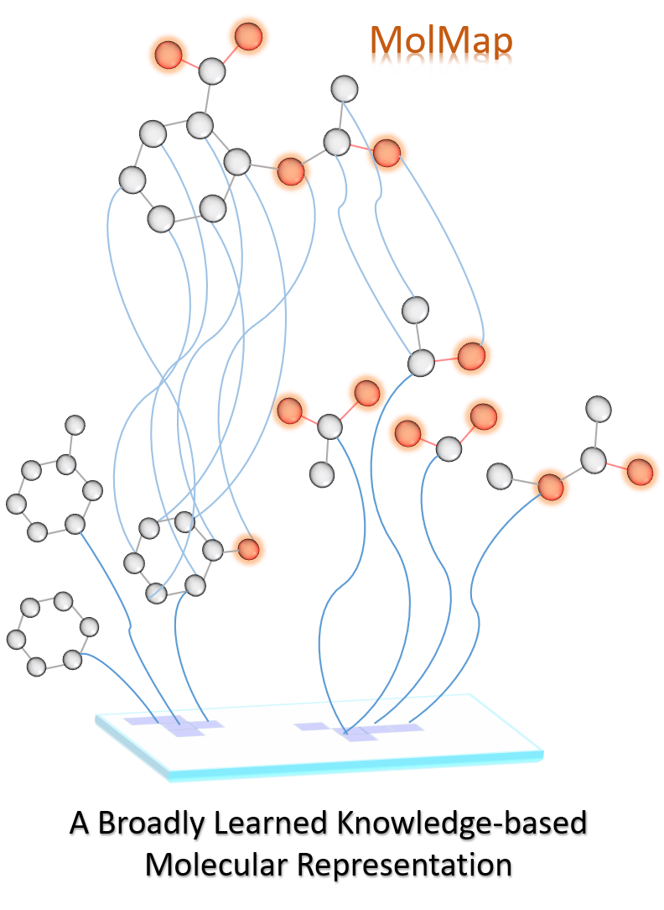

<a href="url"></a>


 
[](https://molmap.readthedocs.io/en/latest/?badge=latest)
[](https://travis-ci.com/shenwanxiang/bidd-molmap) 
[](https://zenodo.org/badge/latestdoi/214117402)
[](https://codeocean.com/capsule/2307823/tree)
[](https://www.nature.com/articles/s42256-021-00301-6)
[](https://badge.fury.io/py/molmap)


## MolMap
MolMap is generated by the following steps:
* Step1: Input structures
* Step2: Feature extraction 
* Step3: Feature pairwise distance calculation --> cosine, correlation, jaccard
* Step4: Feature 2D embedding --> umap, tsne, mds
* Step5: Feature grid arrangement --> grid, scatter
* Step5: Transform --> minmax, standard


### MolMap Fmaps for  compounds


### Construction of the MolMap Objects
---


### The MolMapNet Architecture
---


## Installation
---
1. install [rdkit](http://www.rdkit.org/docs/Install.html) and [tamp](https://tmap.gdb.tools/index.html#support) first(create a molmap env):
```bash
conda create -c conda-forge -n molmap rdkit python=3.7
conda activate molmap
conda install -c tmap tmap
pip install molmap
```

2. [ChemBench](https://github.com/shenwanxiang/ChemBench) (optional, if you wish to use the dataset and the split induces in this paper).


3. If you have gcc problems when you install molmap, please installing g++ first:
```bash
sudo apt-get install g++
```


## Out-of-the-Box Usage
---
* [Example for Regression Task on ESOL (descriptors only)](https://github.com/shenwanxiang/bidd-molmap/blob/master/misc/example/00_model_example_esol_descriptors.ipynb)
* [Example for Classification Task on BACE (fingerprints only)](https://github.com/shenwanxiang/bidd-molmap/blob/master/misc/example/01_model_example_bace_fingerprints.ipynb)

* [Example for Regression Task on FreeSolv (descriptors plus fingerprints)](https://github.com/shenwanxiang/bidd-molmap/blob/master/misc/example/02_model_example_freesolv_dual_path.ipynb)
* [Example for Classification Task on BACE (descriptors plus fingerprints)](https://github.com/shenwanxiang/bidd-molmap/blob/master/misc/example/03_model_example_bace_dual_path.ipynb)

* [Example for Multi-label Classification Task on ClinTox (descriptors plus fingerprints)](https://github.com/shenwanxiang/bidd-molmap/blob/master/misc/example/03_model_example_ClinTox_dual_path.ipynb)


```python
import molmap
# Define your molmap
mp_name = './descriptor.mp'
mp = molmap.MolMap(ftype = 'descriptor', fmap_type = 'grid',
                   split_channels = True,   metric='cosine', var_thr=1e-4)
```

```python
# Fit your molmap
mp.fit(method = 'umap', verbose = 2)
mp.save(mp_name) 
```

```python
# Visulization of your molmap
mp.plot_scatter()
mp.plot_grid()
```

```python
# Batch transform 
from molmap import dataset
data = dataset.load_ESOL()
smiles_list = data.x # list of smiles strings
X = mp.batch_transform(smiles_list,  scale = True, 
                       scale_method = 'minmax', n_jobs=8)
Y = data.y 
print(X.shape)
```

```python
# Train on your data and test on the external test set
from molmap.model import RegressionEstimator
from sklearn.utils import shuffle 
import numpy as np
import pandas as pd
def Rdsplit(df, random_state = 888, split_size = [0.8, 0.1, 0.1]):
    base_indices = np.arange(len(df)) 
    base_indices = shuffle(base_indices, random_state = random_state) 
    nb_test = int(len(base_indices) * split_size[2]) 
    nb_val = int(len(base_indices) * split_size[1]) 
    test_idx = base_indices[0:nb_test] 
    valid_idx = base_indices[(nb_test):(nb_test+nb_val)] 
    train_idx = base_indices[(nb_test+nb_val):len(base_indices)] 
    print(len(train_idx), len(valid_idx), len(test_idx)) 
    return train_idx, valid_idx, test_idx 
```

```python
# split your data
train_idx, valid_idx, test_idx = Rdsplit(data.x, random_state = 888)
trainX = X[train_idx]
trainY = Y[train_idx]
validX = X[valid_idx]
validY = Y[valid_idx]
testX = X[test_idx]
testY = Y[test_idx]

# fit your model
clf = RegressionEstimator(n_outputs=trainY.shape[1], 
                          fmap_shape1 = trainX.shape[1:], 
                          dense_layers = [128, 64], gpuid = 0) 
clf.fit(trainX, trainY, validX, validY)

# make prediction
testY_pred = clf.predict(testX)
rmse, r2 = clf._performance.evaluate(testX, testY)
print(rmse, r2)
```


## Out-of-the-Box Performances
---
| Dataset   | Task Metric | MoleculeNet (GCN Best Model) | Chemprop (D-MPNN model) | MolMapNet (MMNB model) |
|-----------|-------------|-----------------------------|------------------------|-----------------------|
| ESOL      | RMSE        | 0.580 (MPNN)                | 0.555                  | 0.575                 |
| FreeSolv  | RMSE        | 1.150 (MPNN)                | 1.075                  | 1.155                 |
| Lipop     | RMSE        | 0.655 (GC)                  | 0.555                  | 0.625                 |
| PDBbind-F | RMSE        | 1.440 (GC)                  | 1.391                  | 0.721                 |
| PDBbind-C | RMSE        | 1.920 (GC)                  | 2.173                  | 0.931                 |
| PDBbind-R | RMSE        | 1.650 (GC)                  | 1.486                  | 0.889                 |
| BACE      | ROC_AUC     | 0.806 (Weave)               | N.A.                   | 0.849                 |
| HIV       | ROC_AUC     | 0.763 (GC)                  | 0.776                  | 0.777                 |
| PCBA      | PRC_AUC     | 0.136 (GC)                  | 0.335                  | 0.276                 |
| MUV       | PRC_AUC     | 0.109 (Weave)               | 0.041                  | 0.096                 |
| ChEMBL    | ROC_AUC     | N.A.                        | 0.739                  | 0.750                 |
| Tox21     | ROC_AUC     | 0.829 (GC)                  | 0.851                  | 0.845                 |
| SIDER     | ROC_AUC     | 0.638 (GC)                  | 0.676                  | 0.68                  |
| ClinTox   | ROC_AUC     | 0.832 (GC)                  | 0.864                  | 0.888                 |
| BBBP      | ROC_AUC     | 0.690 (Weave)               | 0.738                  | 0.739                 |
